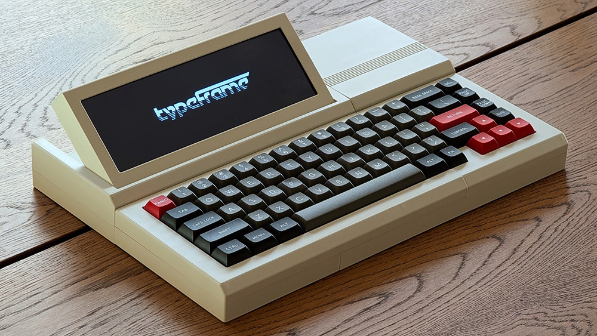
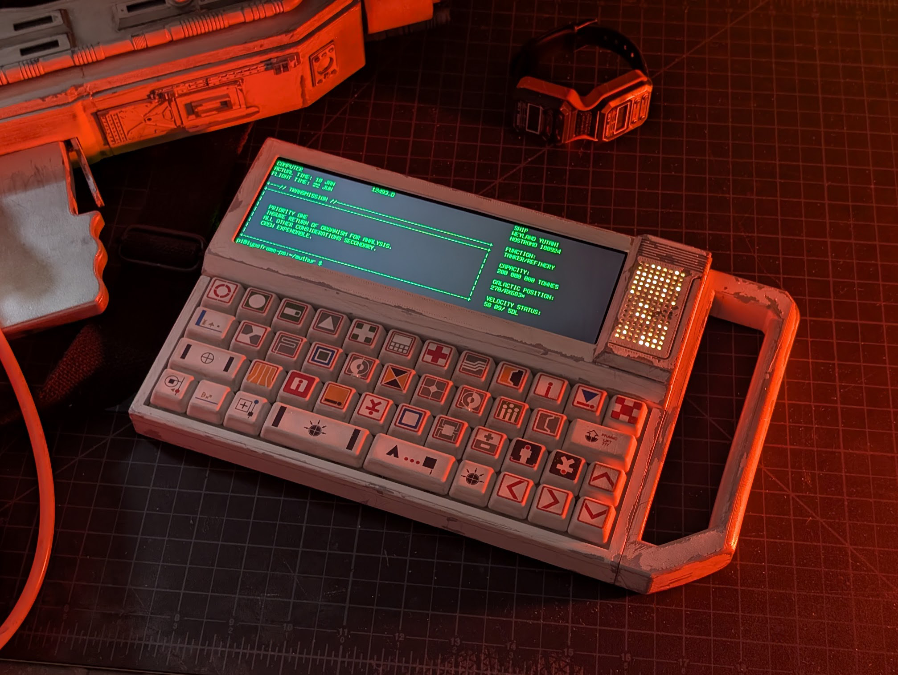

The Typeframe project is a collection of open-source hardware and software for building writerdecks/cyberdecks.

# PX-88

The first model, the PX-88, is a portable-ish computer inspired by the [Epson PX-4](https://www.homecomputermuseum.nl/en/collectie/epson/epson-px-4). The goal was to create a writerdeck that could be used with modern web-based editors.

## Features

- **Mechanical Keyboard**: A detachable 65% keyboard with hot-swappable switches.
- **Touch Screen**: No mouse needed.
- **One Power Connection**: A USB-C port that powers the device _and_ charges the battery.
- **Raspberry Pi 4 B:** Powerful enough to run web-based editors like Google Docs.
- **Software Setup**: A distraction-free laucher, boot splash images, and set up for keyboard shortcuts for screen brightness.
- **Easy to Build**: Minimal soldering required (just the power switch and status light!)

---

# PS-85

The second model, the PS-85, is a rugged barebones slate-style portable computer inspired by the Alien universe

### Features

- **Carrying Handle**: A sturdy handle for easy transport.
- **Exposed GPIO**: Access to all GPIO pins for tinkering or adding your own Bonnets.
- **[MU/TH/UR](https://avp.fandom.com/wiki/MU/TH/UR_6000) LED Matrix**: An optional 9x16 LED matrix, just for fun.
- **Mechanical Keyboard**: A 40% keyboard with hot-swappable switches.
- **One Power Connection**: A Micro USB port that powers the device _and_ charges the battery.
- **Raspberry Pi Zero 2W**: Low power and compact.

## Documentation

For full assembly guides, bill of materials, and software setup instructions, please visit **[typeframe.net](https://www.typeframe.net)**

## Project Structure

- `px-88/`: Contains all files for the PX-88 model.
  - `hardware/`: 3D models and source CAD files.
  - `software/`: Scripts and configuration for the device.
- `ps-85/`: Contains all files for the PS-85 model.
  - `hardware/`: 3D models and source CAD files.
  - `software/`: Scripts and configuration for the device.
- `website/`: The Docusaurus source for the documentation site.

## License

This project uses multiple licenses for different parts of the work. Please see the `LICENSE` file for more details.
