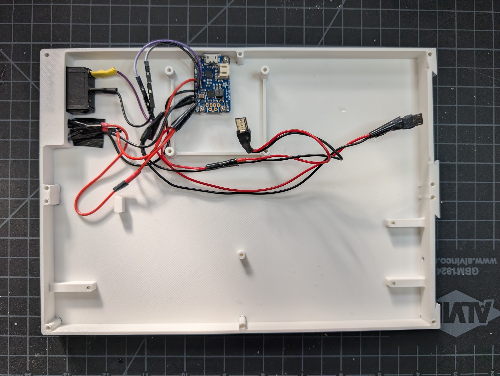
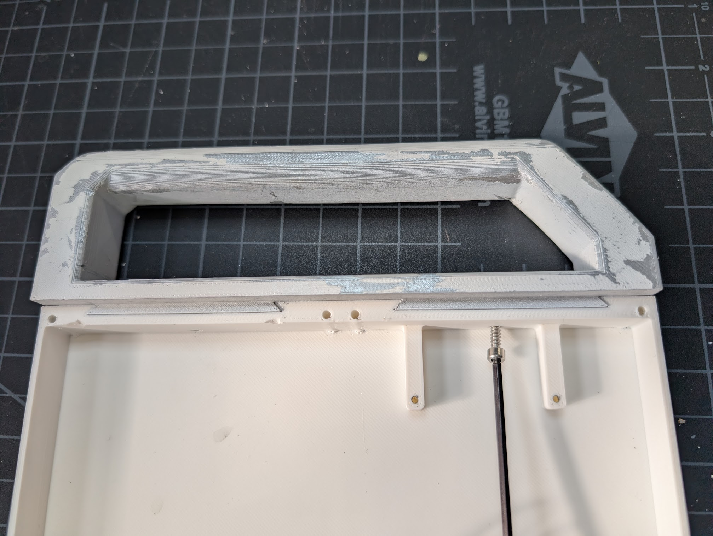
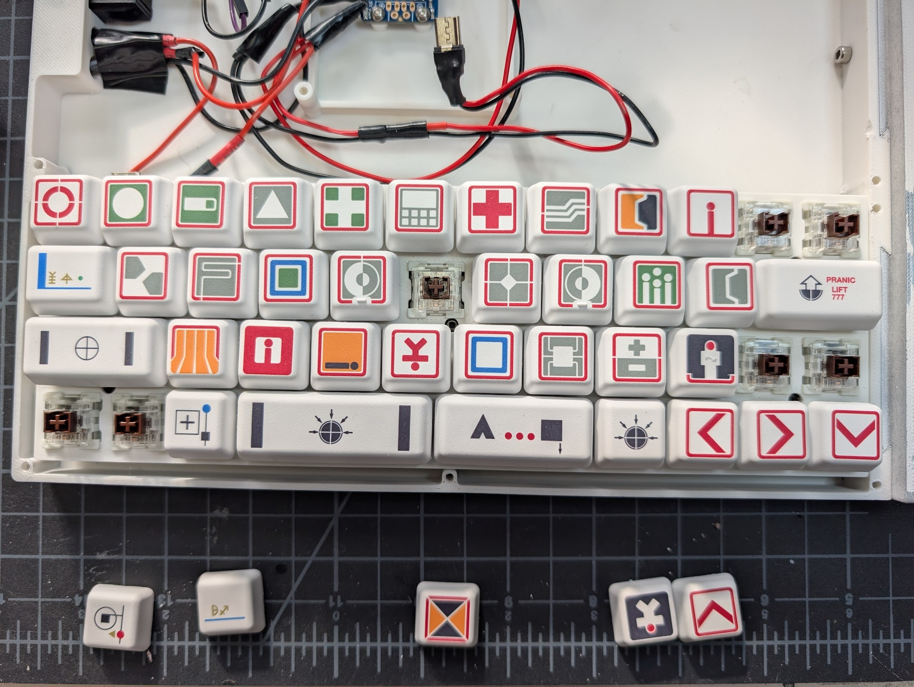
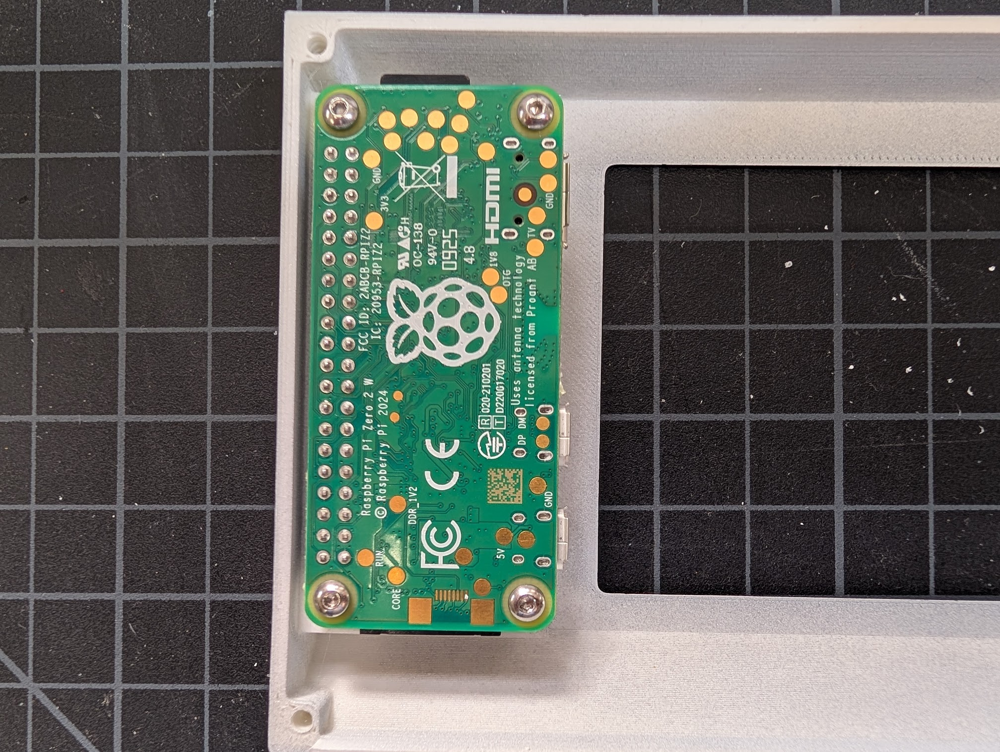
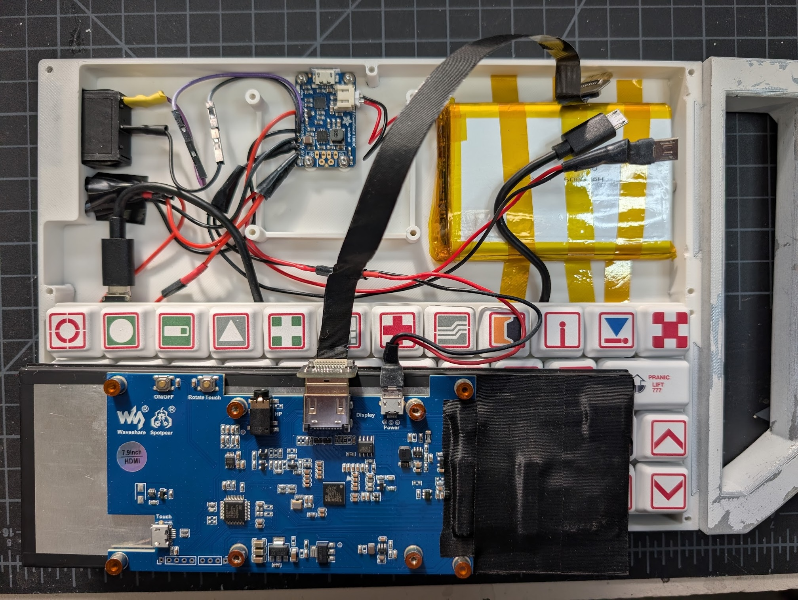
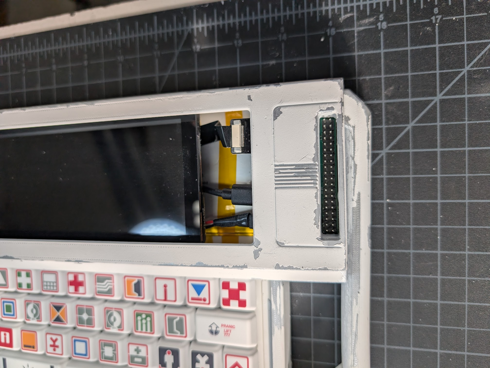
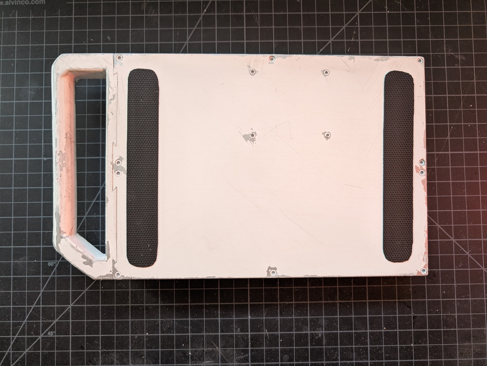
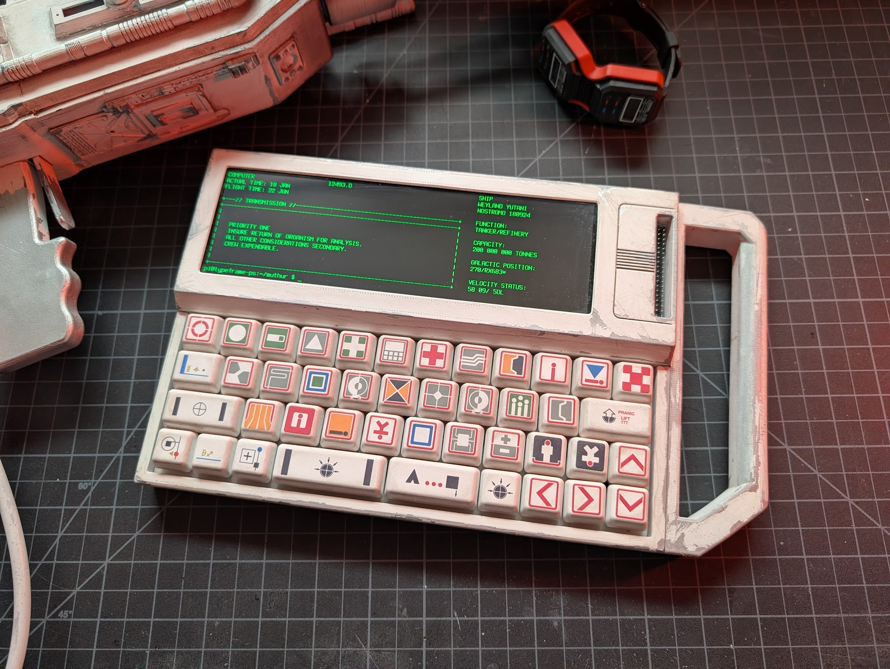
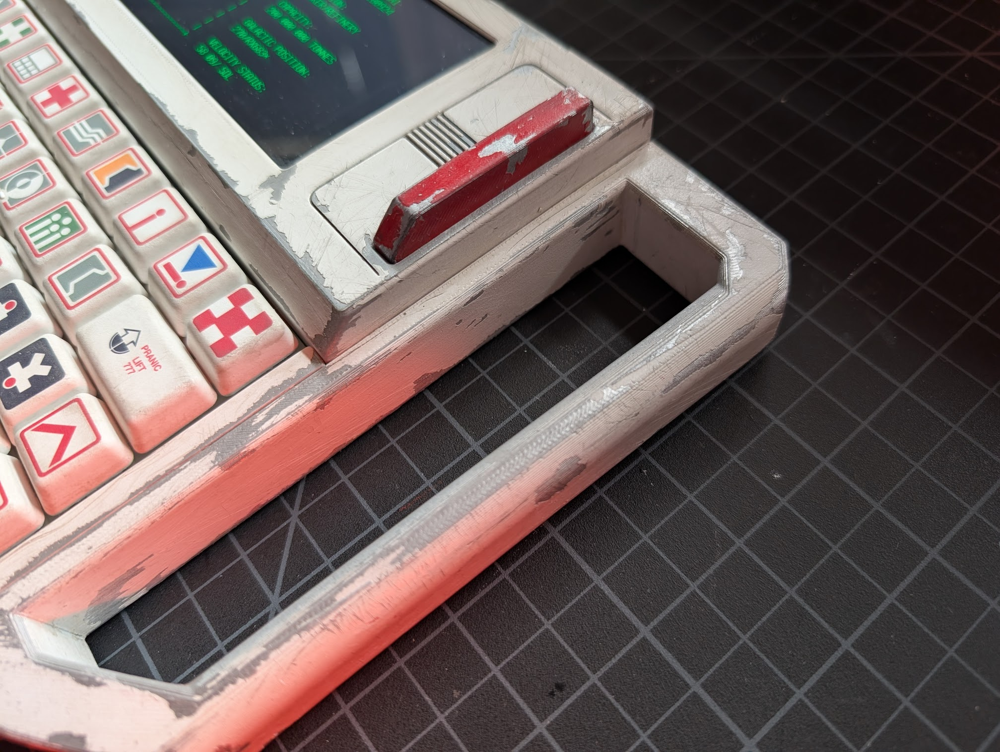
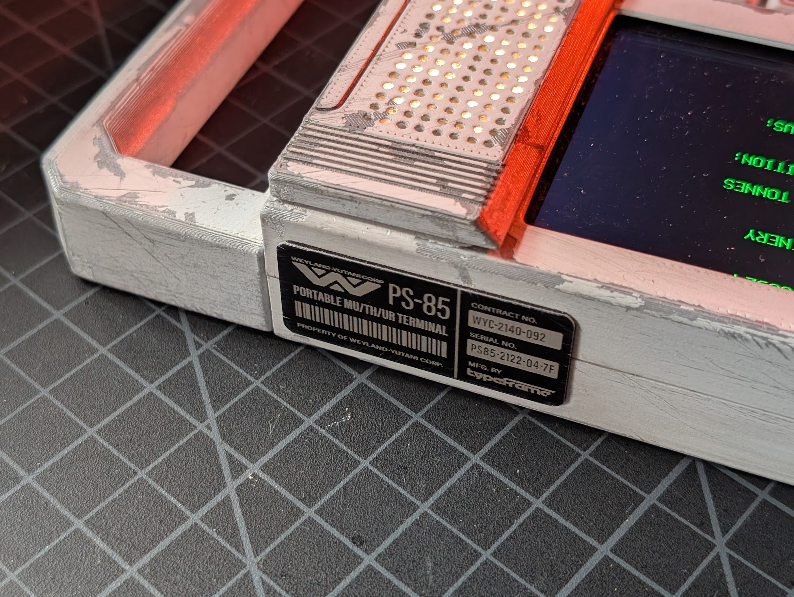

# Case Assembly

## Overview

This section covers the full assembly of the PS-85 case, including installing the electronics, screen, and keyboard. Familiarize yourself with the [electronics assembly](./electronics.md) guide first - there's less detail here as I'm assuming you already have an idea of how the electronics all connect. You can do most of the first steps in any order, just make sure you get the handle on before securing the battery. If you plan on [painting and weathering](./finishing.md), it will be easier to do that before final assembly.

## Main Assembly

### 1. Install PowerBoost, Switch and LEDs

Screw the PowerBoost into the standoffs using four M2.5x4 screws. Insert the power switch from the outside of the case and the LEDs from the inside. You may need to tape down the LEDs to keep them in place.

### 2. Install Handle

Slide the handle into the dovetail joints, then secure it with two M3x10 screws. A ball-end allen wrench will make this easier.

### 3. Install Keyboard and Keyboard Plate

I had the keyboard already assembled, so the photo here just shows the keys removed to access the PCB screws. But essentially you'll just need to secure the PCB to the case with four M2x4 screws - the switches will hold the plate in place once snapped in.

### 4. Install Pi Zero

Secure the Pi Zero to the standoffs on the screen top with four M2.5x8 screws.

### 5. Connect Electronics

Plug in everything except the cables that go to the Pi. More details on this in the [electronics assembly](./electronics.md) guide. Secure the battery with the thermal tape an plug it into the PowerBoost.

### 6. Partly Install Screen

Screw in the screen from the bottom of the case _**only on the non-handle side**_ with two M2.5x20 screws. I found this was easiest from the bottom with the case hanging off the edge of a table. Be careful not to pinch any cables inside. Make sure the HDMI, power and keyboard cables are sticking out towards the handle.

### 7. Connect Cables to Pi

Flip the screen top over and place it overlapping the screen so you can plug the cables into the Pi. (Note the different PWR and USB labeled ports on the Pi Zero.) Then gently lift up the handle side of the screen so you can slide the cables under it and the screen top into place.

### 8. Finish Installing Screen

Screw in the remaining two M2.5x20 screws from the bottom to secure the left side of the screen.

### 9. Join Screen Top to Case Bottom

Using three M3x25 screws in the back and two M3x20 screws in the middle, secure the screen top to the case bottom.

### 10. Install Keyboard Top

Using five M3x16 screws, secure the keyboard top to the case bottom.

### 11. Grip Tape (Optional)

Optionally, you can apply grip tape to the bottom of the case for added traction.

Your PS-85 is now fully assembled!

## GPIO Cover (Optional)

The GPIO cover can be installed at any time. It just slots into the GPIO cutout.

## MU/TH/UR LED Matrix (Optional)

This will be pretty self-explanatory, the cover for the CharliePlex just snaps on and you can plug the matrix into the Pi's GPIO pins using the riser.

