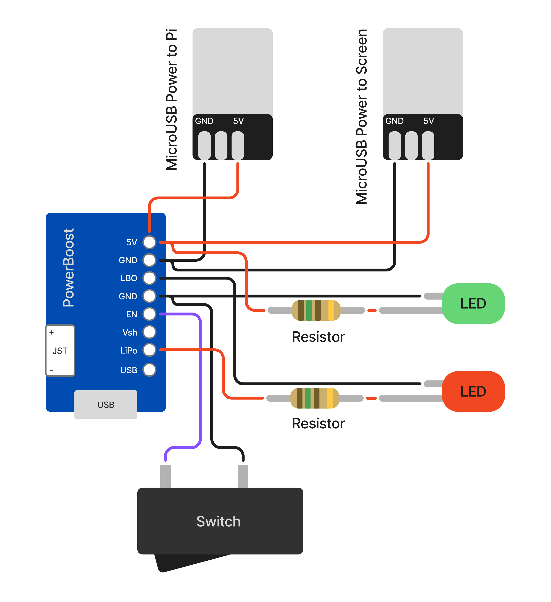
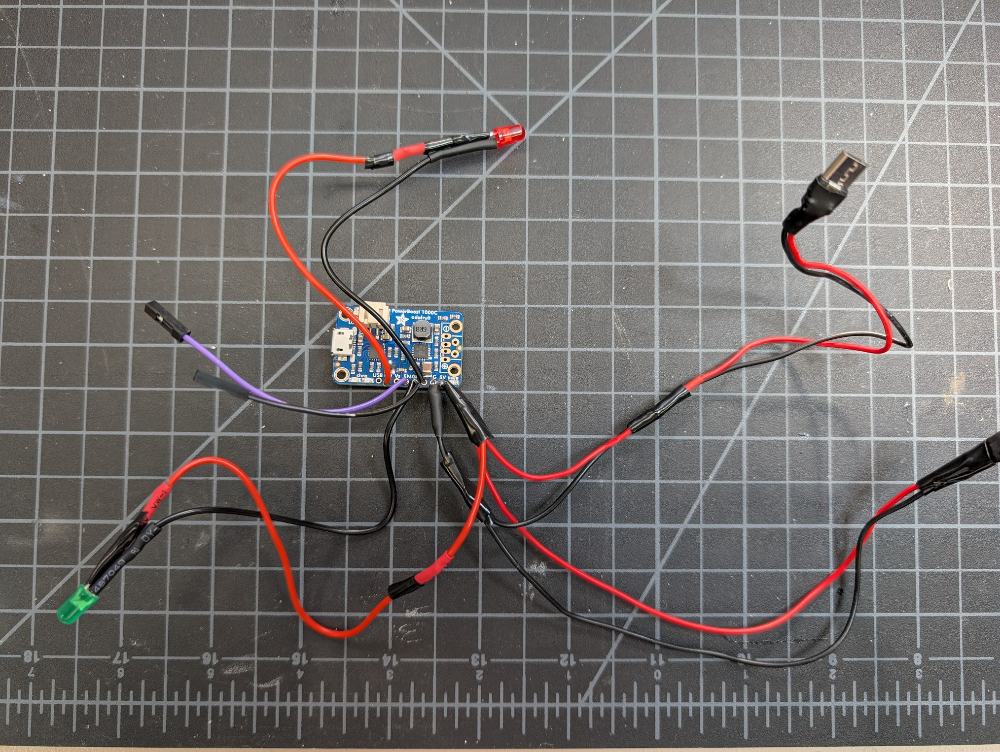

# Electronics Assembly

## Overview

Unlike the PX-88, you'll need to do more soldering for the PS-85. I'd never done it before this, so don't be intimidated if you haven't also! You will likely want to hook most things up before you start putting the case together to make sure the key components work. These steps will be repeated later with less detail in the full assembly guide.

## Soldering Connections to the PowerBoost

When I was putting mine together, I wished I had a diagram like this, so hopefully this helps you out.

| Soldered Connections                                              |
| ----------------------------------------------------------------- |
| PowerBoost `5V` &rarr; MicroB Plug 1 (Pi) `5V`                    |
| PowerBoost `GND` &rarr; MicroB Plug 1 (Pi) `GND`                  |
| PowerBoost `5V` &rarr; MicroB Plug 2 (Screen) `5V`                |
| PowerBoost `GND` &rarr; MicroB Plug 2 (Screen) `GND`              |
| PowerBoost `5V` &rarr; `Resistor` &rarr; Green LED `Long Leg`     |
| PowerBoost `GND` &rarr; Green LED `Short Leg`                     |
| PowerBoost `LBO` &rarr; Red LED `Short Leg`                       |
| PowerBoost `LiPo/BAT` &rarr; `Resistor` &rarr; Red LED `Long Leg` |
| PowerBoost `GND` &rarr; Power Switch `Terminal 1`                 |
| PowerBoost `EN` &rarr; Power Switch `Terminal 2`                  |

You can use any of the `GND` pins on the PowerBoost for the ground connections.

Remember that the power switch requires the wires to be disconnected to be seated in the case later, so you may want to use Dupont connectors for it here.

## Screen

### 1. Assemble the DIY HDMI Cable and Plugs

Attach the two DIY HDMI plugs to either end of the DIY ribbon cable. If you're not sure which direction to insert the cable, look for the metal contacts on the cable - they should face the contacts inside the plugs.

### 2. Connect the Screen to Power and the Raspberry Pi

Plug the Micro USB power into the screen USB port labeled "Power". Plug one end of the DIY HDMI cable into the HDMI port on the screen and the other end into the Raspberry Pi's HDMI port.

## Raspberry Pi Power

Plug the remaining Micro USB port coming from the PowerBoost into the Pi port labeled `PWR IN`.

## Keyboard

You will likely want to print the keyboard plate before you start putting switches in the keyboard PCB. But once assembled, the keyboard should easily drop into the case.

Once assembled, just plug it in to the Raspberry Pi's USB port labeled `USB` with the USB-C to Micro USB cable.

## Battery

### 1. Reverse the Polarity of the Battery Connector

:::danger[Heads up!]

The battery connector may come with the polarity reversed. If the red wire is connected on the wrong side, you'll need to swap the wires so that red goes to positive and black goes to negative. You will 100% fry your PowerBoost if you don't check this! (Ask me how I know...)

:::

This is easy to do, no need to re-solder. You can use a small flathead screwdriver to gently pry up the plastic tabs on the connector and slide the wires out. Then just reinsert them in the correct order.

### 2. Connect the Battery to the PowerBoost 1000c

Plug the battery connector into the JST plug on the PowerBoost. Note the + and - symbols to ensure the polarity is correct. The Pi should power on at this point but won't boot until you complete the software setup.

## Testing

You'll need to jump to the [Software setup section](../software-setup/) to get the Pi booted and the screen working. Once you've done that, you can test all the connections before moving on to final assembly.
