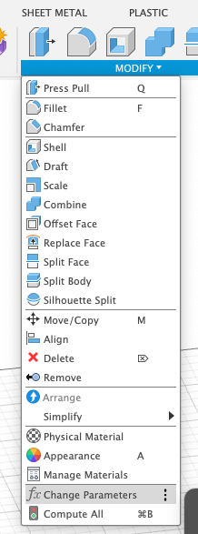
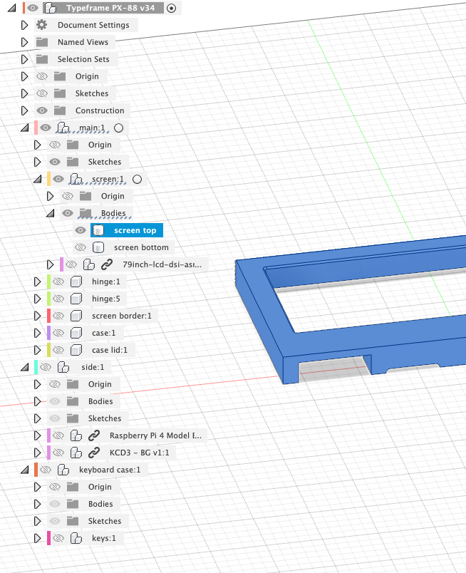

# Printing the Case

## Overview

The case is split into parts that can be printed on an FDM printer with at least a 250mm x 200mm bed.

## Print Files

- [**3MF**](https://github.com/jeffmerrick/typeframe/tree/main/ps-85/hardware/print-files/3MF) - Saved from PrusaSlicer with painted-on supports. These should be ready to slice and print.
- [**STL**](https://github.com/jeffmerrick/typeframe/tree/main/ps-85/hardware/print-files/STL) - Raw STL files for each part.

## Source Files

- [**STEP**](https://github.com/jeffmerrick/typeframe/tree/main/ps-85/hardware/source-files/typeframe-ps-85.step) - Step file of the entire assembly.
- [**F3Z**](https://github.com/jeffmerrick/typeframe/tree/main/ps-85/hardware/source-files/typeframe-ps-85.f3z) - I can't seem to export a .f3d because of some linked components. Hopefully, the .f3z will work if you want to dig into it. Fair warning that the timeline is a bit of a mess, though I did try to keep components named and somewhat organized.

## Tolerances and Parameters

Default tolerances are pretty tight but worked for me on my Prusa MK4. If you run into issues, let me know which parts and I can try to export out STLs with looser tolerances.

### Default Tolerance Parameters

| Parameter                  | Value   |
| -------------------------- | ------- |
| `pressFitTolerance`        | 0.00 mm |
| `closeFitTolerance`        | 0.05 mm |
| `freeFitTolerance`         | 0.1 mm  |
| `screwCounterboreDepth`    | 2.8 mm  |
| `screwCounterboreDiameter` | 5 mm    |
| `screwPassthroughDiameter` | 3 mm    |
| `screwTappingDiameter`     | 2.6 mm  |

## Changing Parameters in Fusion 360

If you need to customize the parameters further for your printer, you can open the F3Z file in Fusion 360 and modify them there.

1. Download [Fusion 360 for Personal Use](https://www.autodesk.com/products/fusion-360/personal).
2. Open the `typeframe-ps-85.f3z` file.
3. Go to the **Modify** menu and select **Change Parameters**.  
   
4. Modify the parameters as needed.
   
5. You can now export new STL files with **File > Export**. Make sure only the part you want to export is visible in the browser. (Otherwise it seems to export out everything visible.) 
   
6. Alternatively you may be able to send the selected part directly to your slicer with **File > 3D Print**. No need to hide the other parts this way.

## Supports

The files print pretty well with minimal supports. But you will need supports for some parts, mostly for the larger port holes. The 3MF files have supports painted on.

## Print Settings

I printed on a Prusa MK4 with a 0.4mm nozzle and 0.2mm layer height using PLA filament. I had the best results with a smooth PEI sheet for bed adhesion. For the case bottom I used helper discs to keep the corners from lifting. You may also want to use a brim for some parts if you have adhesion issues.
