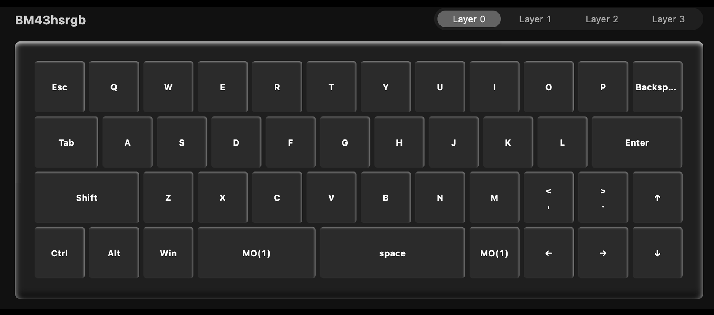
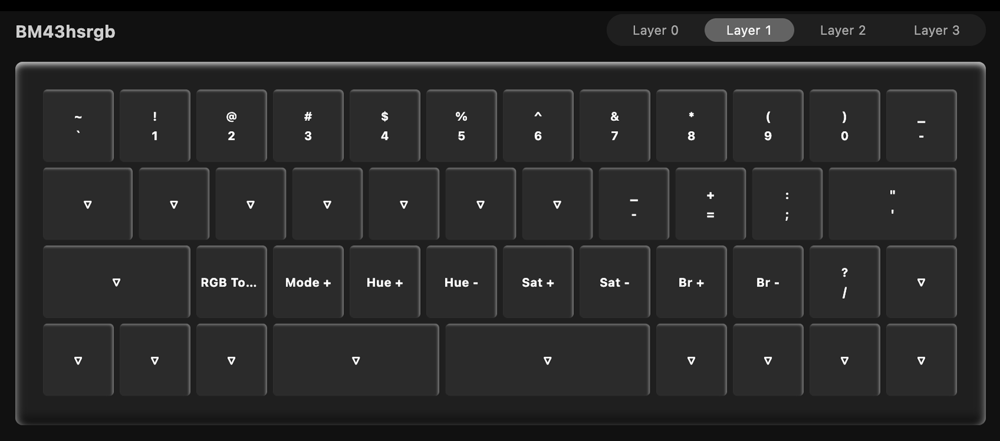

# Keyboard Setup

## Overview

The [BM43 documentation](http://kpchn.com/s/PoHJ?path=%2F003-BM%20Series) is somewhat confusing. No matter what I did I couldn't get the keyboard to work with usevia.app. During my troubleshooting I flashed the VIA firmware, however the PCB might actually come with it pre-flashed as I discovered I was able to configure it with the Keychron configuration app instead of the official VIA app. If anyone figures out more details, let me know so I can update the docs!

### 1. Connect with the Keychron App

1. Download the keyboard layout JSON file. I have a working one in the repo in [ps-85/software/keyboard](https://github.com/jeffmerrick/typeframe/tree/main/ps-85/software/keyboard).
2. Plug in the keyboard and navigate to [https://launcher.keychron.com/](https://launcher.keychron.com/).
3. Click "Connect".
4. Choose the BM43 in the dialog and click "Connect"
5. When prompted choose the JSON file you downloaded in step 1.

### 2. Modify Key Mappings

Since this is a 40% keyboard, you'll want to customize it in a way that makes sense to you. Here's what I did:

**Default Layer (Layer 0)**

**Function Layer (Layer 1)**

I also exported this out so you can use mine if you'd like, also in [ps-85/software/keyboard](https://github.com/jeffmerrick/typeframe/tree/main/ps-85/software/keyboard).

### 3. Save Changes

Changes are saved automatically as you make them. When you're done, just unplug the keyboard and it's ready to go!
