# Case Assembly

## Overview

This section covers the full assembly of the PX-88 case, including installing the electronics, screen, and keyboard. Familiarize yourself with the [electronics assembly](./electronics.md) guide first - there's less detail here as I'm assuming you already have an idea of how the electronics all connect.

## Keyboard

### 1. Join Case Bottom Halves

Using two M3x10 screws and one M3x12 screw, join the two bottom halves of the keyboard case together. The longer screw goes in the front. You may want to use a ball-end allen wrench here as the angle is somewhat awkward.

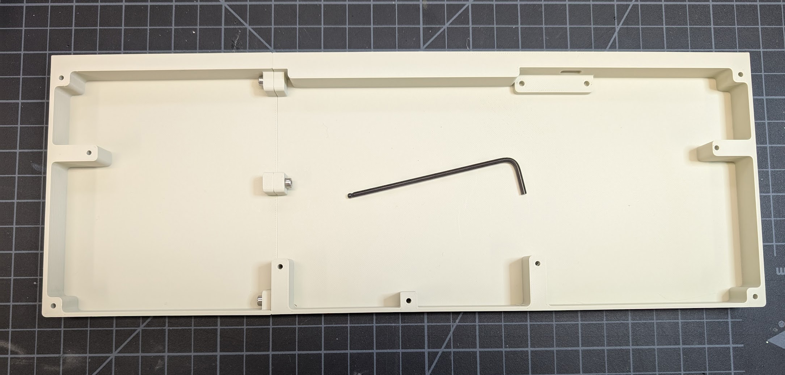

### 2. Install the Keyboard Daughterboard

Using two M3x6 screws, install the keyboard daughterboard into the bottom of the case. Plug the included cable into the daughterboard.

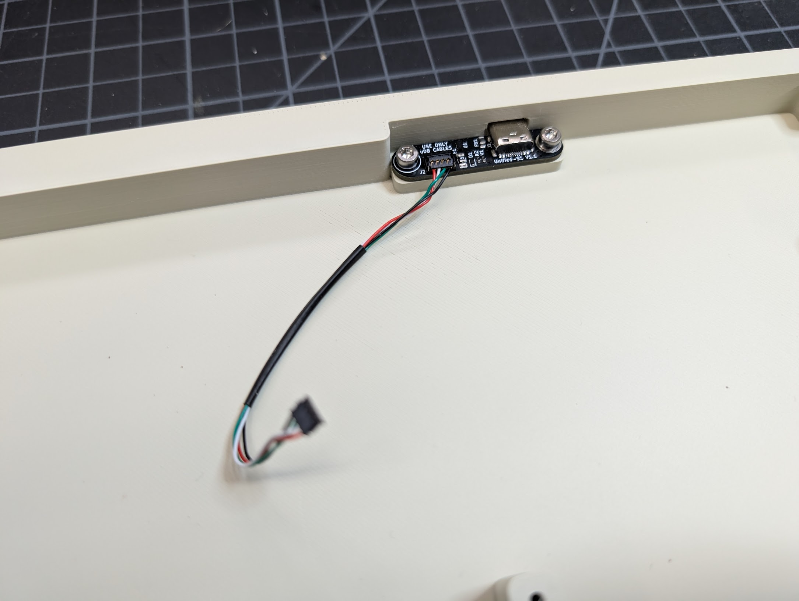

### 3. Install the Keyboard Stabilizers

Using the included hardware, install the keyboard stabilizers into the PCB.

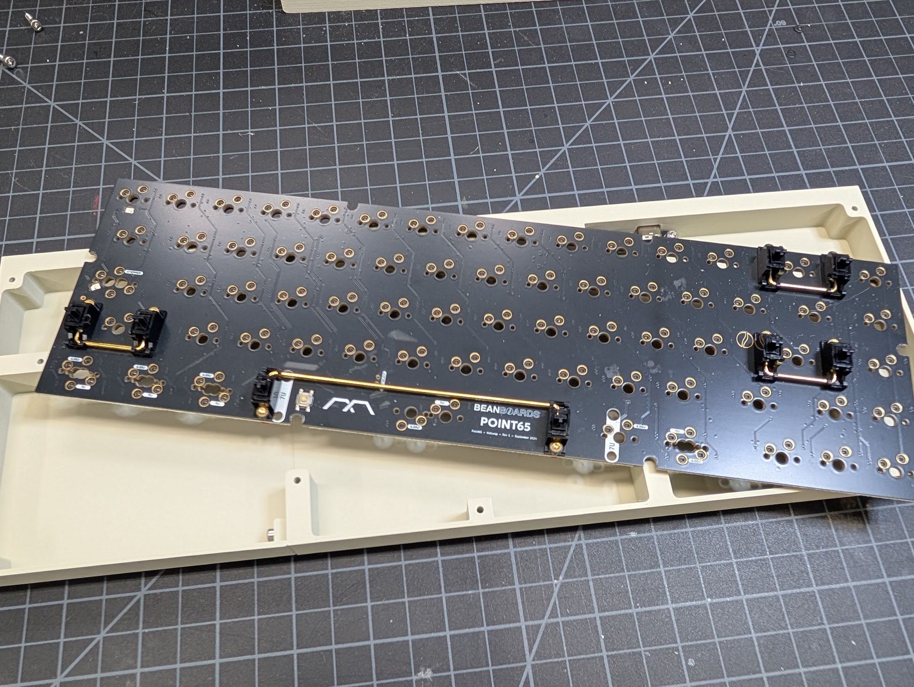

### 4. Connect the Daughterboard to the Keyboard PCB

Connect the daughterboard cable to the bottom of the keyboard PCB.

### 5. Install the Keyboard PCB

Using the 4 M3x10 screws, install the keyboard PCB into the case. I used M3 washers here as well, but it seemed to work fine without them. You'll see a rubber band on the back of the PCB in the photo - this was to prevent the PCB from flexing down when typing, but it ended up being unnecessary.

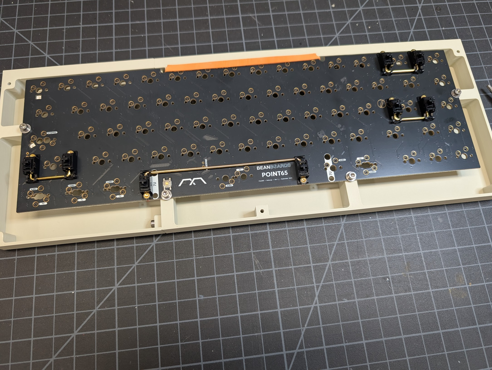

### 6. Join the Case Top Halves

Slide the two top halves of the keyboard case together at the dovetail in the back. Then, using one M3x10 screw, connect them in the front. The screw will stick out a little bit but that's okay.

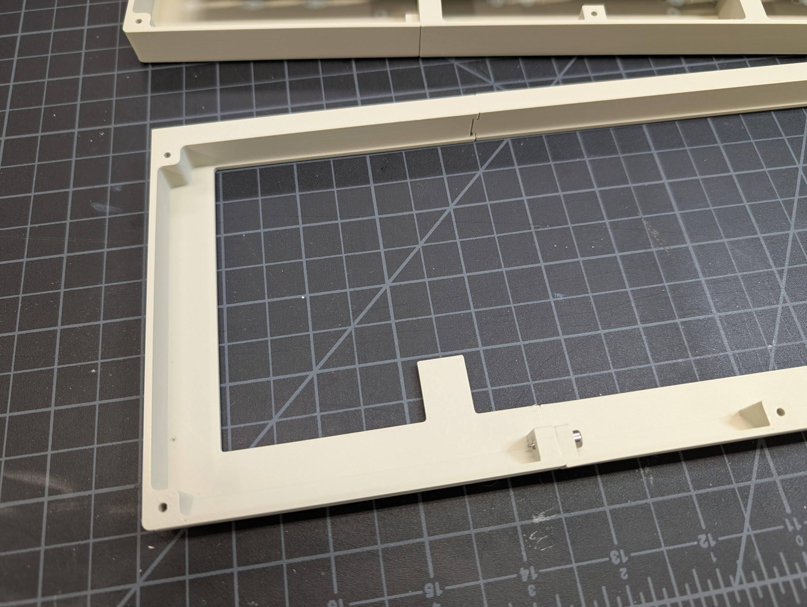

### 7. Join the Top and Bottom Halves

Using five M3x20 screws, join the top and bottom halves of the keyboard case together.

### 8. Install Switches and Keycaps

**Congratulations!** You now have a finished keyboard! You can use it with or without the rest of the PX-88 case. Just connect it via USB-C to your computer.

## Case Bottom

### 1. Join the Case Bottom Halves

Using two M3x14 screws, join the two bottom halves of the case together.

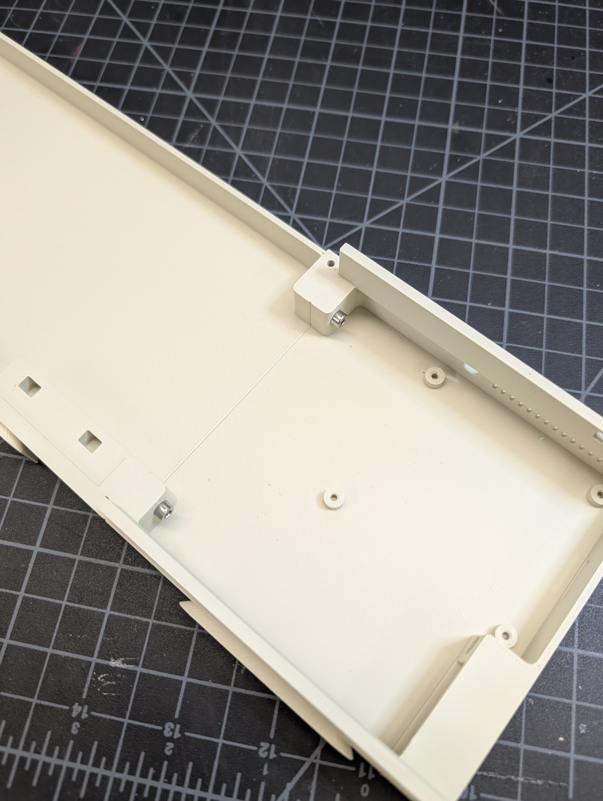

### 2. Add the Screen Frame

Flip over the case bottom. Using 4 M3x20 screws, attach the screen frame to the bottom half of the case.

### 3. Install the Battery

Make sure you have the extension cable connected to the battery. (I don't in the photo, but it's easier to do now.) Secure the battery in the left side of the case bottom using thermal tape.

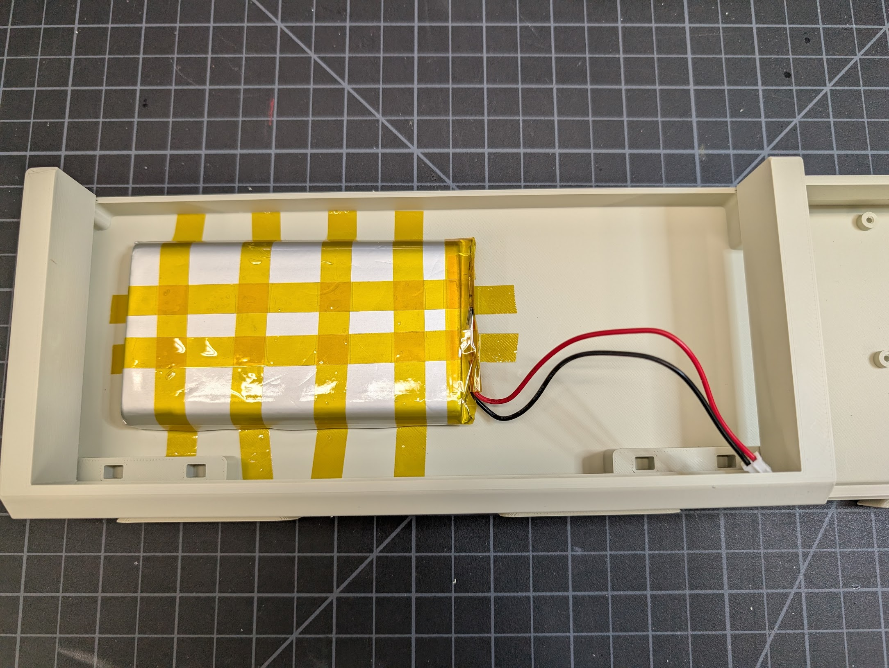

## Screen

### 1. Attach the Screen to the Screen Back

1. Attach the DSI cable and 4 pin cable (+ extension jumpers) to the screen as described in the [electronics assembly](./electronics.md) guide.

2. Using four M2.5x12 screws, attach the screen to the screen back at the screen's four standoff mounting points.

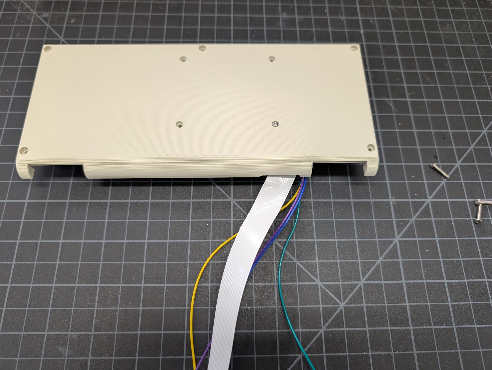

### 2. Join the Screen Back to the Front

Using five M3x16 screws, join the screen back and the screen front, being careful not to pinch any cables.

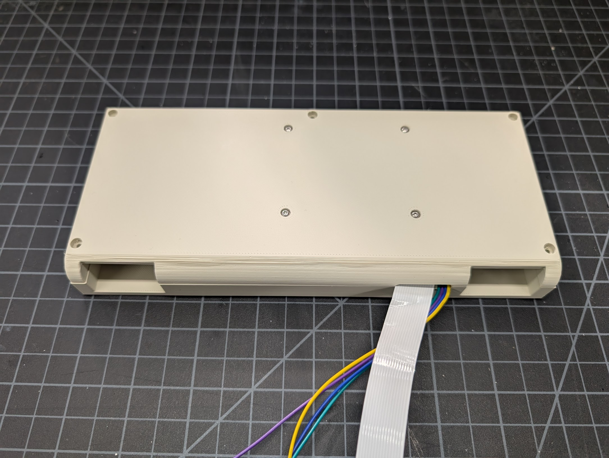

### 3. Assemble the Hinges

This ingenious friction hinge design was created by [KatDelgado on Printables](https://www.printables.com/model/658393-friction-hinge-mechanism). The shaft that goes into the threaded slider should be very tight as this is what provides the resistance and keeps the screen upright. No glue should be required.

1. Insert the shaft into the threaded slider.
2. Screw the shaft into the hinge body.
3. Add the caps on each end.

Repeat for the other hinge.

### 4. Attach the Hinges to the Screen

Slide the hinges into the slots on the bottom of the screen assembly.

### 5. Route the Screen Cables Through the Case Bottom

1. Route the DSI cable and 4 pin cable through the case bottom next to the battery.
2. Slide the case lid into place.

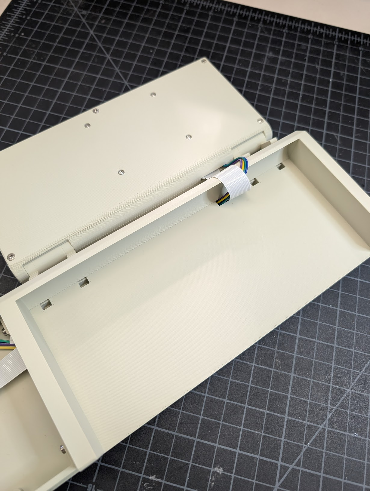

### 6. Attach the Screen Assembly to the Case Bottom

Slide the hinges into the slots on the front of the case bottom.

## Case Side

:::danger[Stop! Set up software first!]

You must at least install the [Power Management HAT Firmware](../software-setup/power-management-hat.md) before this step. It requires connecting the Pi directly to power and the Pi's USB-C power port will be inaccessible once it's in the case.

:::

### 1. Install the Raspberry Pi in the Case

Using the standoffs included with the Power Management HAT, install the Raspberry Pi into the case side. I found using the included M2.5 screws to assist in screwing in the standoffs made it easier. You may also want to plug in the keyboard USB cable now. I didn't in the photo and it was awkward to do later.

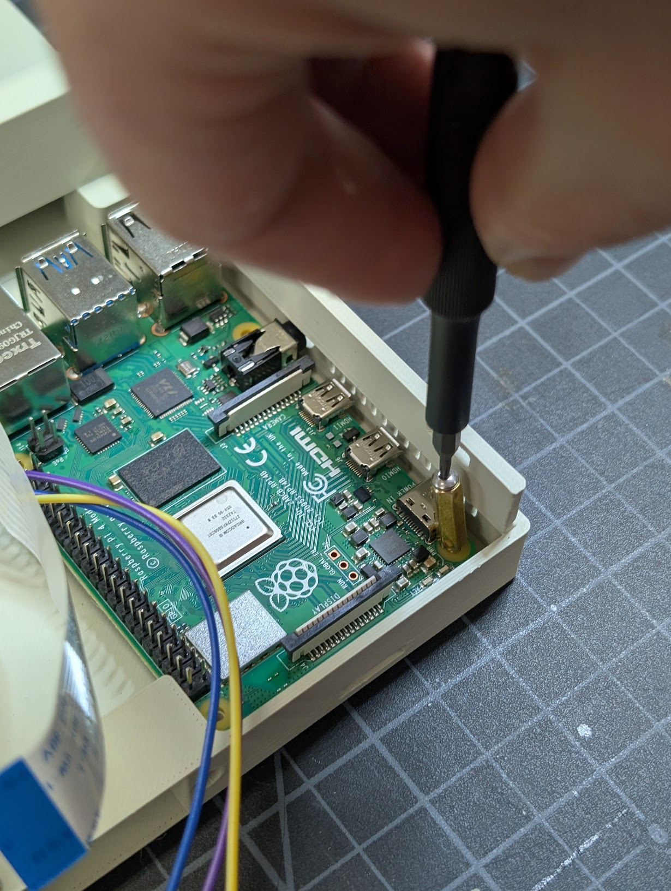

### 2. Connect Screen to the Pi

1. Connect the DSI cable to the DSI port on the Raspberry Pi.
2. Route the battery cable on top of the Pi.

### 3. Install the Power Switch

Follow the [electronics assembly](./electronics.md#power-switch) guide to solder the wires to the switch and Power Management HAT. Note that if you don't use Dupont jumpers you'll need to install the power switch with wires attached into the case before soldering the wires to the HAT.

1. Slide the power switch into the case side from the outside of the case.
2. Connect power switch jumper cables to jumper cables soldered to the Power Management HAT.

### 4. Install the Power Management HAT

1. Align the Power Management HAT with the GPIO pins on the Raspberry Pi and press down firmly to seat it.
2. Secure the HAT with the included M2.5 screws.

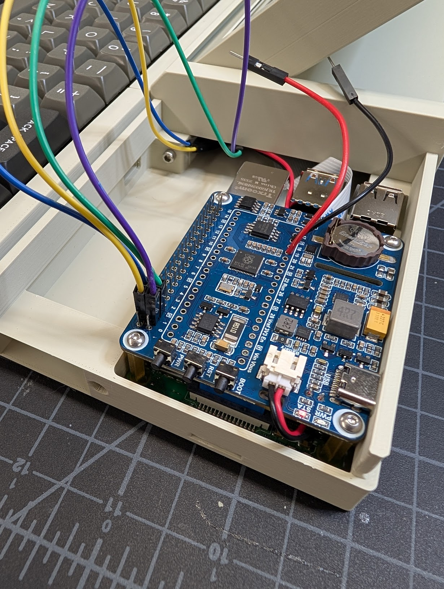

### 5. Install the Status LED

Follow the [electronics assembly](./electronics.md#status-led) guide to solder the jumper wires and resistor to the LED.

1. Insert the LED into the hole next to the power switch from the inside of the case.
2. Connect the LED jumper cables to the proper GPIO pins on the Power Management HAT header.

### 6. Connect the Keyboard to the Case

1. Slide the keyboard down onto the dovetails on the front of the case.
2. Plug the keyboard into the USB-C cable that's connected to the Pi.

### 7. Final Connections

1. Plug the battery cable into the Power Management HAT.
2. Plug the 4 pin screen cable into the Power Management HAT header as outlined in the [electronics assembly](./electronics.md#2-connect-the-4-pin-cable-to-the-gpio-header) guide.

Here's what everything looks like when fully connected:

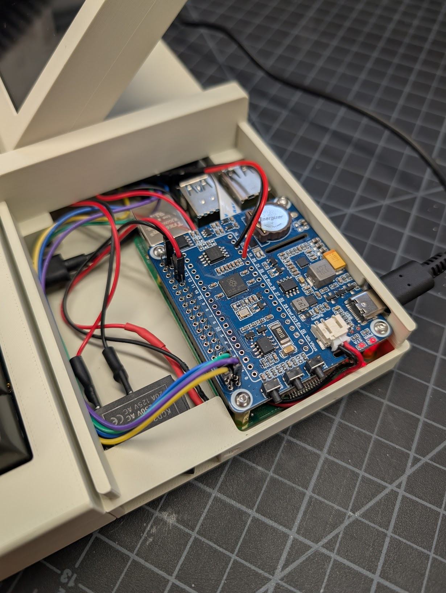

### 8. Close the Case Side

Slide the case side top half from the right into the rails on the bottom half.

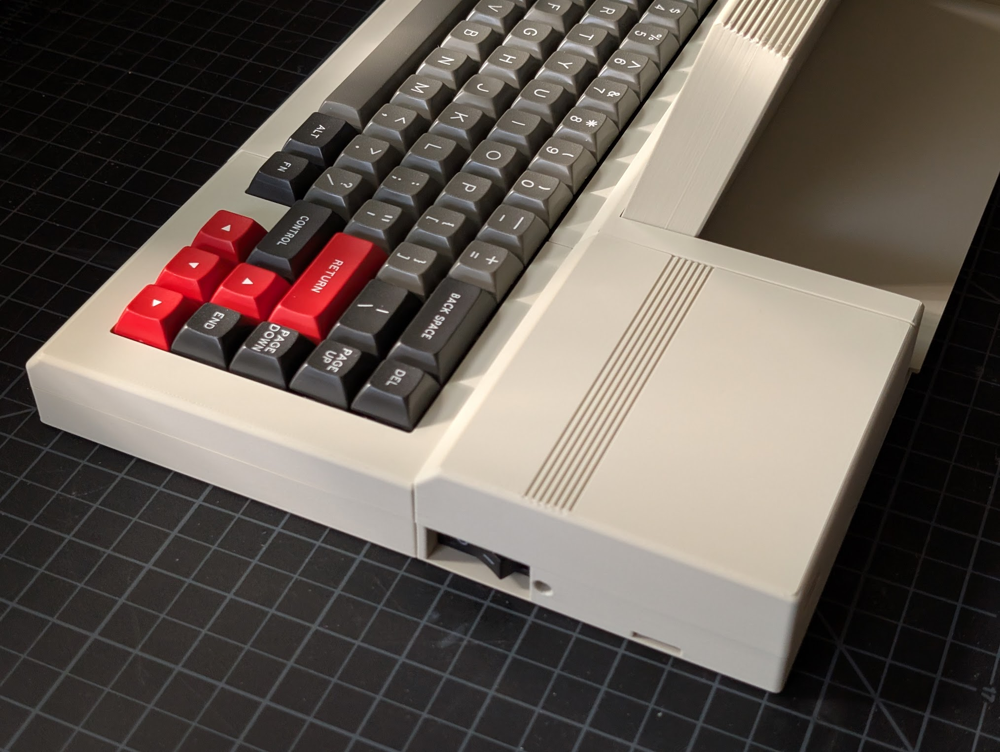

:::success[Congratulations!]
You have finished assembling the PX-88!
:::
