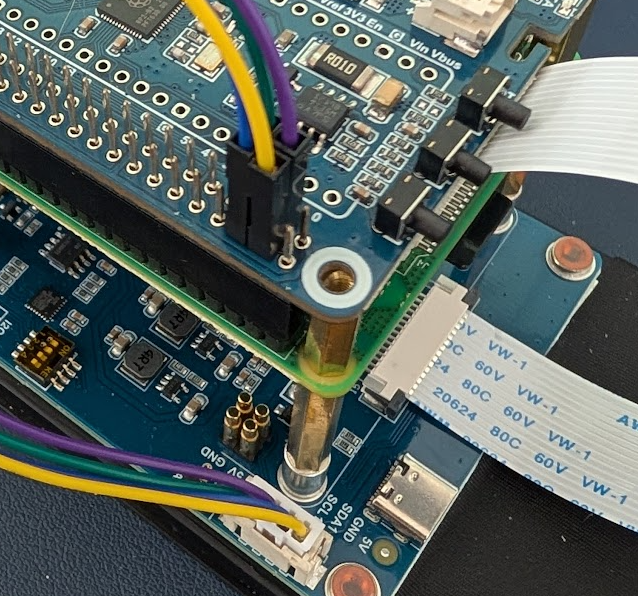

# Electronics Assembly

## Overview

Here I'll go over how to connect the electronics for the PX-88. This includes connecting the Raspberry Pi, screen, Power Management HAT, and other components like the power switch and status light. You will likely want to hook everything up before you start putting the case together to make sure everything works. Most of these steps will be repeated later with less detail in the full assembly guide.

## Battery and Power Management HAT

### 1. Reverse the Polarity of the Battery Connector

:::danger[Heads up!]

The battery connector may come with the polarity reversed. If the red wire is connected on the wrong side, you'll need to swap the wires so that red goes to positive and black goes to negative.

:::

This is easy to do, no need to resolder. You can use a small flathead screwdriver to gently pry up the plastic tabs on the connector and slide the wires out. Then just reinsert them in the correct order.

You want it to look like this:

Other photos may be a bit confusing as the extension cable does not have the wires swapped, but the battery connector does.

### 2. Attach the 200mm Extension Cable to the Battery

If you really want the colors to match you can swap the wires on the extension cable as well, but it's not strictly necessary as long as you keep track of which wire is which.

### 3. Install the 1220 Lithium Battery

Insert the 1220 lithium battery into the battery holder on the Power Management HAT.

### 4. Attach the Power Management HAT to the Raspberry Pi

Push the GPIO header that came with the Power Management HAT into the GPIO pins on the Raspberry Pi, then the HAT itself onto the header. Don't worry about the standoffs since we're just testing, but hang on to them for later.

### 5. Connect the Battery to the Power Management HAT

Plug the battery connector into the battery port on the Power Management HAT. Note the + and - symbols to ensure the polarity is correct. In my photos the black wire on the extension cable is actually the positive wire.

## Screen

### 1. Connect the DSI Cable from the Screen to the Raspberry Pi

Using the longer 500mm DSI ribbon cable, connect one end to the screen and the other end to the DSI port on the Raspberry Pi. Make sure the cable is securely inserted and the connectors are properly aligned. If you're not sure which direction to insert the cable, look for the metal contacts on the cable - they should face the contacts inside the connector.

### 2. Connect the 4 Pin Cable to the GPIO Header

1. Plug the provided 4 pin connector into the screen - you'll see labels for each pin on the back of the screen. For mine they corresponded to the following wire colors (yours may be different, so double check!):

   - 5V - Yellow
   - GND - Blue
   - SDA1 - Purple
   - SCL1 - Green

2. Connect the other ends of the 4 pin connector to your Dupont female to male jumpers. You can choose the same colors to make things easier. Again, as we're just testing you can skip this step if you want to add the extension cable later.

3. Connect the jumpers to the GPIO header on the Power Management HAT as follows:

   - 5V - Yellow - 5V Power (Physical Pin 4)
   - GND - Blue - Ground (Physical Pin 6)
   - SDA - Purple - GPIO2 (SDA) (Physical Pin 3)
   - SCL - Green - GPIO3 (SCL) (Physical Pin 5)

Here's an older photo when I was testing things out, you won't need to have the standoffs installed but can see the connections:

## Keyboard

If you want to test out the keyboard you can hook it up, but you'll need to follow the keyboard assembly to get the stabilizers, switches, and keycaps installed as well. You may want to wait until later and use SSH or an extra keyboard for initial testing.

### 1. Connect Keyboard to Daughterboard

It connects with a small included cable. The cable goes in with the bigger metal contacts facing out and slots straight down.

### 2. Connect Daughterboard to Raspberry Pi

Using your small USB-A to USB-C cable, connect the daughterboard to one of the Raspberry Pi's USB ports.

## Power Switch

You'll need to do a bit of soldering here. You can also skip this step and use the onboard power button on the Power Management HAT for testing. If you choose to solder before installing the switch in the case, you may want to use Dupont connectors to make it easier to connect and disconnect later. (Otherwise you'll likely need to resolder!)

### 1. Solder Wires to Power Switch

Solder two female Dupont connectors to the two terminals on the power switch. It doesn't matter which wire goes to which terminal. My soldering kit came with some heat shrink tubing, which I used here to cover the exposed contacts after soldering.

### 2. Solder Two Male Dupont Connectors to the Power Management HAT.

- Connect one to the Pin 19
- Connect the other to a Ground pin (labeled G)

Once the firmware is installed, this switch will perform the same function as the onboard power button on the HAT.

## Status LED

As with the power switch, you can add the status LED later if you'd like - it's easy to drop in after everything else is assembled.

### 1. Solder Dupont Jumpers to Status LED

Solder two female Dupont connectors to the two terminals on the status LED. Solder the red wire to the longer leg (positive) and the black wire to the shorter leg (negative). Include your 150Ω resistor in series with either wire.

### 2. Connect Jumpers to GPIO Header on Power Management HAT

- Connect the red wire (with resistor) to GPIO 19 (Physical Pin 35)
- Connect the black wire to a Ground pin (Physical Pin 39)

Note that the status LED won't work until some confguration is done later in the software setup section.

Here's a photo of everything hooked up when it's installed in the case later:

## Testing

<!-- @TODO: Add link to software setup section. -->

You'll need to jump to the Software setup section to get the Pi booted, the screen working, and the Power Management HAT firmware installed. Once you've done that you can test all the connections before moving on to final assembly.
