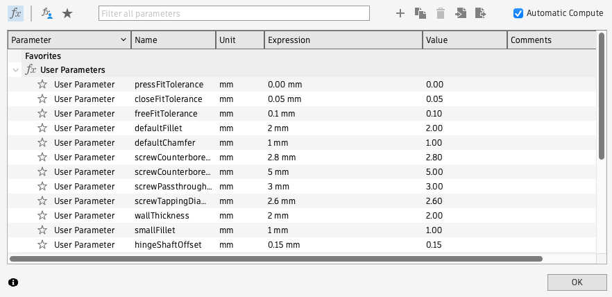

# Printing the Case

## Overview

The case is split into parts that can be printed on an FDM printer with at least a 232mm x 130mm bed.

## Print Files

### Tight Tolerances

- [**3MF**](https://github.com/jeffmerrick/typeframe/tree/main/px-88/hardware/print-files/tight-tolerances/3MF) - Saved from PrusaSlicer with painted-on supports. These should be ready to slice and print.
- [**STL**](https://github.com/jeffmerrick/typeframe/tree/main/px-88/hardware/print-files/tight-tolerances/STL) - Raw STL files for each part. Parts with multiples are suffixed with `_x#`.

### Loose Tolerances

- [**STL**](https://github.com/jeffmerrick/typeframe/tree/main/px-88/hardware/print-files/loose-tolerances/STL) - Raw STL files for each part. Parts with multiples are suffixed with `_x#`.

_See more on tolerances below._

## Source Files

- [**STEP**](https://github.com/jeffmerrick/typeframe/tree/main/px-88/hardware/source-files/typeframe-px-88.step) - Step file of the entire assembly.
- [**F3Z**](https://github.com/jeffmerrick/typeframe/tree/main/px-88/hardware/source-files/typeframe-px-88.f3z) - I can't seem to export a .f3d because of some linked components. Hopefully, the .f3z will work if you want to dig into it. Fair warning that the timeline is a bit of a mess, though I did try to keep components named and somewhat organized.

## Tolerances and Parameters

Default tolerances are pretty tight but worked for me on my Prusa MK4. However, others had trouble with them on other printers so I've included a set of STLs with looser tolerances as well. Each set also includes hinge parts with a few different offsets

### Default Tight Tolerance Parameters

| Parameter                  | Value   |
| -------------------------- | ------- |
| `pressFitTolerance`        | 0.00 mm |
| `closeFitTolerance`        | 0.05 mm |
| `freeFitTolerance`         | 0.1 mm  |
| `screwCounterboreDepth`    | 2.8 mm  |
| `screwCounterboreDiameter` | 5 mm    |
| `screwPassthroughDiameter` | 3 mm    |
| `screwTappingDiameter`     | 2.6 mm  |

### Loose Tolerance Parameters

| Parameter                  | Value   |
| -------------------------- | ------- |
| `pressFitTolerance`        | 0.05 mm |
| `closeFitTolerance`        | 0.15 mm |
| `freeFitTolerance`         | 0.2 mm  |
| `screwCounterboreDepth`    | 2.8 mm  |
| `screwCounterboreDiameter` | 5.2 mm  |
| `screwPassthroughDiameter` | 3.2 mm  |
| `screwTappingDiameter`     | 2.8 mm  |

### Hinge Tolerances

The **`hingeShaftOffset`** determines the resistance level of the hinges. You want this quite tight as they will loosen over time. The offset you need will vary depending on your printer and print settings. I was able to print with a 0mm offset and get the shaft into the slider a plumbers wrench. I've included versions with a 0.05mm, 0.10mm, and 0.15mm offset for you to try out as well. In addition if you have trouble screwing the slider into the barrel, I've included versions of the barrel with the same offsets as well.

## Changing Parameters in Fusion 360

If you need to customize the parameters further for your printer, you can open the F3Z file in Fusion 360 and modify them there.

1. Download [Fusion 360 for Personal Use](https://www.autodesk.com/products/fusion-360/personal).
2. Open the `typeframe-px-88.f3z` file.
3. Go to the **Modify** menu and select **Change Parameters**.  
   
4. Modify the parameters as needed.
   
5. You can now export new STL files with **File > Export**. Make sure only the part you want to export is visible in the browser. (Otherwise it seems to export out everything visible.) 
   
6. Alternatively you may be able to send the selected part directly to your slicer with **File > 3D Print**. No need to hide the other parts this way.

## Supports

The files print pretty well with minimal supports. But you will need supports for some parts, mostly for the larger port holes. The 3MF files have supports painted on.

## Print Settings

I printed on a Prusa MK4 with a 0.4mm nozzle and 0.2mm layer height using PLA filament. I had the best results with a smooth PEI sheet for bed adhesion since there are some large parts.

## Credits

The ingenious friction hinge design is from [KatDelgado on Printables](https://www.printables.com/model/658393-friction-hinge-mechanism). Thanks to the detailed information there, I was able to adapt it for this project.
