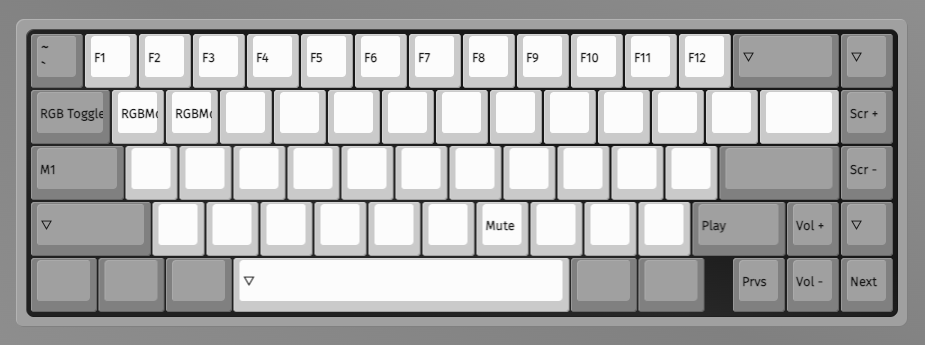

# Keyboard Setup

## Overview

The keyboard PCB comes ready to go with firmware installed, but you may want to adjust the key mappings. I recommend connecting the keyboard to a larger computer for this since the touch screen on the PX-88 would make it difficult.

## Adjust Key Mappings with VIA

### 1. Connect with VIA

1. Download the keymap JSON file. You can find them on the Mechanical Keyboards [product page](https://mechanicalkeyboards.com/products/mk-point65-keyboard-kit), but I've also dropped them into the repository in [px-88/software/keyboard](https://github.com/jeffmerrick/typeframe/tree/main/px-88/software/keyboard). There are different ones for the RGB and Multi-Layout versions of the PCB.
2. Plug in the keyboard and navigate to [https://www.usevia.app/](https://www.usevia.app/).
3. You'll need to go to the settings (gear icon) and toggle "Show Design tab" on.
4. Navigate to the Design tab (paintbrush icon) and click "Load" to import the keymap JSON file you downloaded earlier.
5. Now navigate to the "Configure" tab (keyboard icon) and click "Authorize device".
6. Choose Point 65 Hotswap in the dialog and click "Connect"

### 2. Modify Key Mappings

I don't remember the defaults but here's what I landed on:

**Default Layer (Layer 0)**

**Function Layer (Layer 1)**

The keyboard had some lights on by default on the left side. In order to turn them off I had to use the `RGB Toggle` key. In addition, I mapped the screen brightness controls to `MO(1) + PgUp` and `MO(1) + PgDn` using the `Screen +` and `Screen -` keycodes. We'll set up shortcuts to make those work later in the setup.

### 3. Save Changes

Changes are saved automatically as you make them. When you're done, just unplug the keyboard and it's ready to go!
