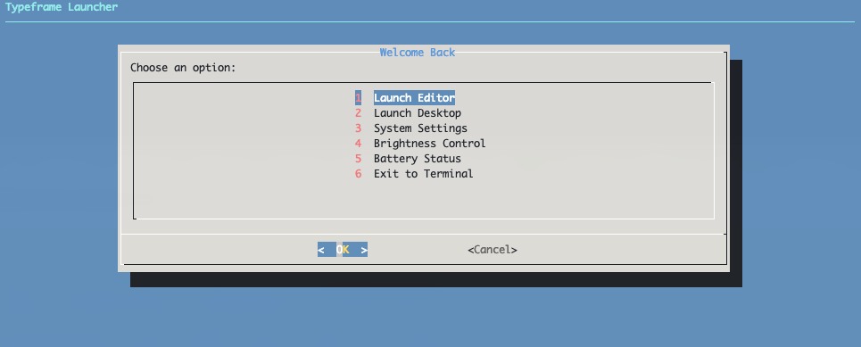

# Install the Application Launcher



This is a bash script that provides a terminal-based application launcher for the PX-88. It allows you to easily launch a full-screen browser window with a URL of your choice from a text-based menu when booting to the terminal.
By default, it opens Google Docs, but you can edit `launcher.sh` to open anything you'd like. It also allows you to control the screen brightness and view the battery status.

### 1. Configure Boot Behavior

First, set the Pi to boot to terminal instead of desktop:

```bash
sudo raspi-config nonint do_boot_behaviour B2
```

Boot options:

- **B1** - Console (text console, requiring user to login)
- **B2** - Console Autologin (text console, automatically logged in as 'pi' user)
- **B3** - Desktop (desktop GUI, requiring user to login)
- **B4** - Desktop Autologin (desktop GUI, automatically logged in as 'pi' user)

### 2. Install Required Dependencies

```bash
sudo apt-get install dialog
```

### 3. Copy Launcher Script

Download or copy the launcher file to the Typeframe directory in your home directory.

```bash
# Download launcher script from GitHub
cd ~/Typeframe
mkdir ~/launcher
wget https://raw.githubusercontent.com/jeffmerrick/typeframe/refs/heads/main/px-88/software/launcher/launcher.sh

# Make the shell script executable
sudo chmod +x launcher.sh
```

### 4. Auto-launch on Boot

To automatically start the launcher when you boot, run this command to add the launcher to your `.bashrc`:

```bash
echo '~/Typeframe/launcher/launcher.sh' >> ~/.bashrc
```
